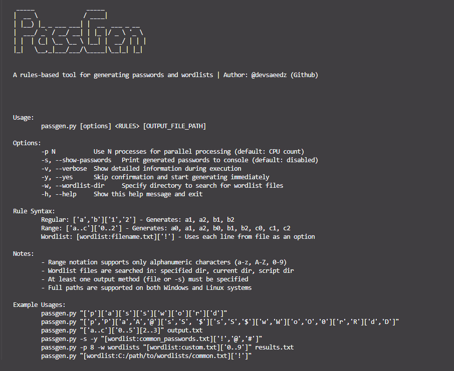

# PassGen

PassGen is a powerful password generation tool that creates wordlists based on customizable rules.




## Features

- Generate passwords based on customizable rules
- Support for character ranges (a-z, A-Z, 0-9)
- Import wordlists to use as password components
- Multiprocessing support for faster generation
- Cross-platform (Windows, Linux, macOS)

## Installation

### Option 1: Install as Python Package

```bash
git clone https://github.com/devsaeedz/passgen.git
cd passgen
pip install .
```

### Option 2: Create Standalone Executable (Recommended)

The easiest way is to use the included build script:

```bash
python build.py
```

This will:
1. Install PyInstaller if needed
2. Clean any existing build artifacts
3. Create a standalone executable in the `dist` folder

#### Manual Build (Alternative)

If you prefer to manually create the executable:

1. Install PyInstaller:
```bash
pip install pyinstaller
```

2. Create the executable:
```bash
pyinstaller --onefile --hidden-import sys --hidden-import os --hidden-import multiprocessing passgen.py
```

## Usage

```
passgen [options] <RULES> [OUTPUT_FILE_PATH]
```

### Options

- `-p N`: Use N processes for parallel processing (default: CPU count)
- `-s, --show-passwords`: Print generated passwords to console
- `-v, --verbose`: Show detailed information during execution
- `-y, --yes`: Skip confirmation and start generating immediately
- `-w, --wordlist-dir`: Specify directory to search for wordlist files
- `-h, --help`: Show help message and exit

### Rule Syntax

- Regular: `['a','b']['1','2']` - Generates: a1, a2, b1, b2
- Range: `['a..c']['0..2']` - Generates: a0, a1, a2, b0, b1, b2, c0, c1, c2
- Wordlist: `[wordlist:filename.txt]['!']` - Uses each line from file as an option

### Examples

```bash
# Basic usage
passgen "['p']['a']['s']['s']['w']['o']['r']['d']"

# Character alternatives
passgen "['p','P']['a','A','@']['s','S', '$']['s','S','$']['w','W']['o','O','0']['r','R']['d','D']"

# Using ranges
passgen "['a..c']['0..5'][2..3]" output.txt

# Using wordlists
passgen -s -y "[wordlist:common_passwords.txt]['!','@','#']"

# Specifying wordlist directory
passgen -p 8 -w wordlists "[wordlist:custom.txt]['0..9']" results.txt

# Full paths
passgen "[wordlist:C:/path/to/wordlists/common.txt]['!']"
passgen "[wordlist:/home/user/wordlists/common.txt]['!']"
```


## License

This project is licensed under the MIT License - see the [MIT License](LICENSE) file for details.

